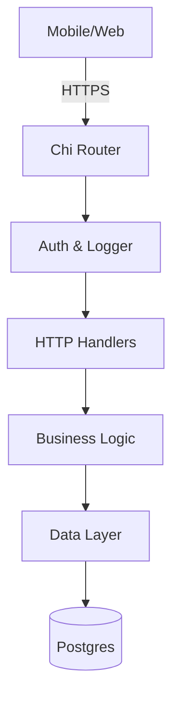

# Salvia System Architecture

> **The "Salvia Way"**: No Magic. Explicit SQL. Native Auth. High Performance.

This document is the **Technical Manual** for the Salvia backend. It explains how the system works, how data is structured, and how security is enforced.

---

## 1. High-Level Design

Salvia is a monolith API built in Go. It interacts with Postgres (Data), Redis (Cache), and S3 (Storage).

### Core Technologies
*   **Go 1.25+**: Strong typing, concurrency.
*   **Postgres 16**: Primary source of truth.
*   **pgx/v5**: High-performance database driver.
*   **Chi**: Zero-allocation HTTP router.

---

## 2. Authentication & Authorization

We use a **Native Auth** system (replacing Supabase).

### A. Identities
*   **Users** (`users` table): Global identity (Email/Password).
*   **Staff** (`staff` table): Membership in an Organization.
*   **Invitations** (`staff_invitations` table): Temporary access tokens.

### B. Security Strategy
1.  **Passwords**: Hashed using `bcrypt` (Cost 12). Never stored plain.
2.  **Tokens**: Dual-token system.
    *   **Access Token (JWT)**: Short-lived (15m). Used for API calls.
    *   **Refresh Token (Opaque)**: Long-lived (7d). Stored in HTTP-Only cookie. Used to get new Access Tokens.
3.  **RBAC (Permissions)**:
    *   `Role='admin'`: Unlimited access.
    *   `Role='staff'`: Checks `staff.permissions` JSONB column (e.g., `{"can_view_notes": true}`).

### C. The Login Flow
1.  User posts `email` + `password`.
2.  Server verifies hash.
3.  Server issues Access Token (Body) + Refresh Token (Cookie).

---

## 3. Database Design

We use **19 Tables** optimized for clinical workflows.

### Key Decisions
*   **UUIDs (v7)**: Used everywhere for primary keys (sortable timeline).
*   **JSONB**: Used for flexible data (Permissions, Form Templates).
*   **Triggers**: Used for auditing (`updated_at`) and versioning (`increment_version`).

### Core Domains
1.  **Organization**: `organizations`, `staff`, `groups`.
2.  **Patients**: `beneficiaries`, `beneficiary_group_assignments`.
3.  **Notes**: `audio_notes`, `generated_notes`, `form_templates`.

---

## 4. Key Workflows

### Staff Onboarding (Magic Invite)
1.  Admin generates invite -> `staff_invitations` table.
2.  Email sent with link -> `app.sal.com/join?token=XYZ`.
3.  Staff clicks -> Validates Token -> Sets Password -> Account Active.

### Audio Processing
1.  Mobile App uploads audio -> `audio_notes` (Status: `pending`).
2.  Background Worker picks up job -> Transcribes (Whisper) -> Summarizes (LLM).
3.  Result saved to `generated_notes` (Status: `draft`).
